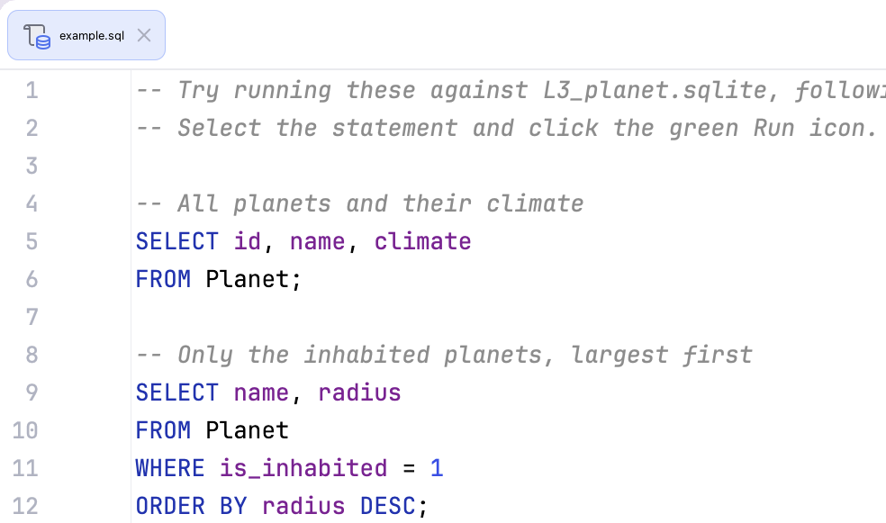

## Editor

The **Editor** is your playground for programming. You can use it to experiment with code while working on theory tasks and quizzes, since these changes are not checked.

For programming assignments, use the Editor to modify existing code or write your own from scratch. This code will be checked when you submit your solution.

  

We'll show you how to run SQL queries later in this course.

To go back to the Editor and focus on your code, use the **Hide All Windows** command (&shortcut:HideAllWindows;). To restore your previous layout, simply repeat the command.

