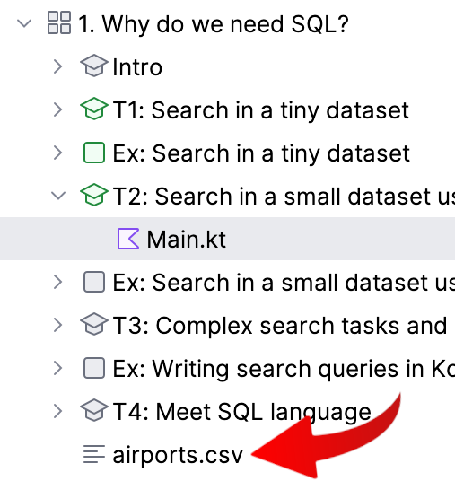

Look into the [airport.csv](course://Lesson1/airports.csv) file that you can find in this lesson.

<div style="text-align: center; max-width: 300px; margin: 0 auto;">

</div>

When the amount of data grows, search with eyes becomes troublesome. You can easily miss some value, or count it twice,
or make other mistakes.

If you want to do a reliable search within a table with more than a few dozens of rows, you need some automation. Spreadsheets, like Excel or Google Sheets, are handy for many quick and relatively simple tasks, such as finding 
the maximum or minimum values, because they allow filtering the rows or sorting the rows by any column. 

If you are a command-line addict, you can use command-line tools for such tasks. For instance, 
the simple **`sort`** utility can sort its input by any column and thus find the maximum or minimum value in that column
as well as the row where that value is found. If you're on Linux, macOS, or even Windows with Linux tools, try running
these commands in %IDE_NAME% Terminal (hit *&shortcut:ActivateTerminalToolWindow;*) to find the busiest airport in a bigger dataset:  

```
cd Lesson1
cat airports.csv | sort -t, -k7 -n -r | head -n 1
```
