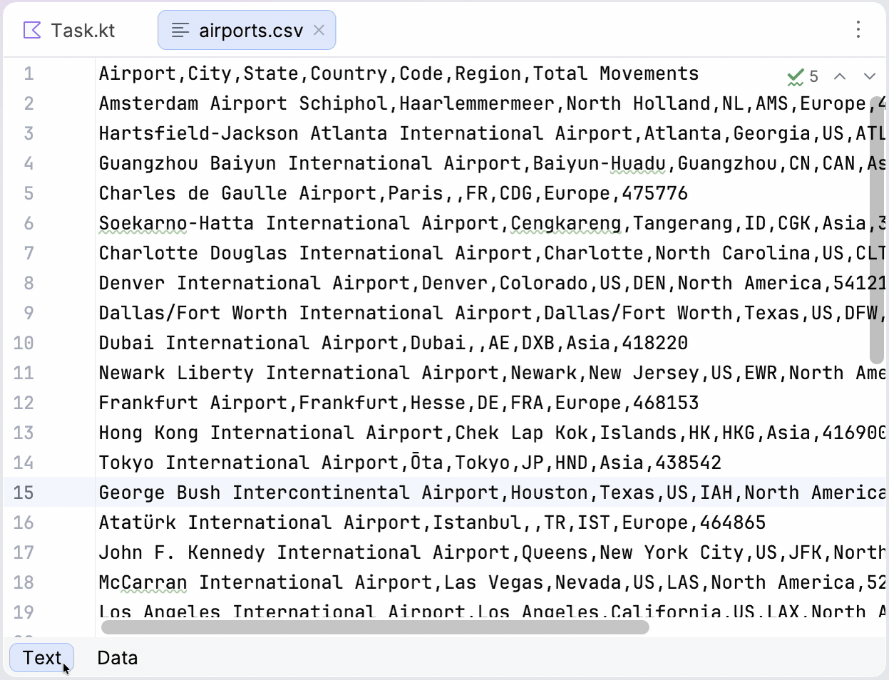

Let's continue with the [airports.csv](course://Lesson1/airports.csv) file in this lesson.

Use a spreadsheet or command-line tools, or [data view](https://www.jetbrains.com/help/idea/editing-csv-and-tsv-files.html), which is built into %IDE_NAME%, to find the busiest European airport, that is, the one with the greatest number of movements across all airports located in Europe.

### Task
Type the airport code and the number of movements in the placeholders in a file opened in the editor pane instead of `???` and `0`.
