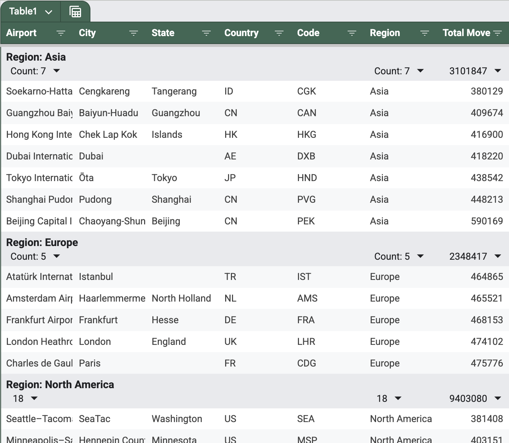

When either the amount of data or the search task complexity, or both of them, grow further, spreadsheets or 
text-based command-line tools become less usable. What if you want to calculate the total count of 
movements summed across all airports for each country? Or what if you want to calculate the average count of 
movements for all airports excluding those of North America? 

Spreadsheets can actually filter data, as well as group and calculate aggregated grouped values in pivot tables:

<div style="text-align: center; max-width: 800px; margin: 0 auto;">

</div>

Good knowledge of Unix command-line text processing tools may help as well. For instance, here is how we can calculate 
the total sum of movements by region using the **`awk`** tool:

```
cd Lesson1
cat airports.csv | awk -F, 'NR>1 {arr[$6]+=$7} END {for (a in arr) print a, arr[a]}'
```

<div class="hint" title="Result">

```
North America 9403080
Asia 3101847
Europe 2348417
```
</div>


However, data grows bigger, search requests become more complex, and we need to search more often and to have the results fast. 
We need something different from making manual or semi-automated manipulations with spreadsheets or writing awkward shell scripts.

One may argue that we can write a search code using a general-purpose programming language, such as Kotlin or Python.
This may work well if all our data fits into RAM and all our queries are known in advance, which allows for writing 
efficient code with relatively little effort. In the next task, you can try writing simple search code in Kotlin.