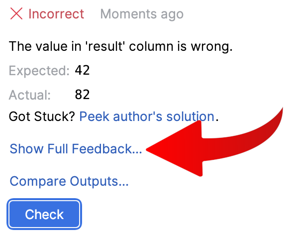

You've seen how `SELECT` evaluates arithmetic expressions and how parentheses
change the order of operations.

### Task
In `task.sql`, add parentheses to the expression so that the query
returns **42** in the `result` column.

Edit `task.sql` and click **Check**.

### How checking works in this course
When you click **Check**, the plugin runs the query from your `task.sql` file against a small
test database (which is empty in this task) and compares its returned rows against the expected output. If they match, the
task is marked as solved. If they don't, %IDE_NAME% displays a short error message.

For a more detailed report, click the **Show Full Feedback…** link:

<div style="text-align: center; max-width: 350px; margin: 0 auto;">

</div>

In the tool window that opens at the bottom of %IDE_NAME%, you'll see something similar to this:

```
The value in 'result' column is wrong. 

EXPECTED: 
| result |
|--------|
| 42     |

ACTUAL: 
| result |
|--------|
| 82     |

QUERY: 
SELECT 8*10 + 4/2 AS result;
```

Read this report from the bottom up:

* **QUERY** — The exact SQL that was executed, so you can see how your expression was interpreted.
* **ACTUAL** — The table returned by your query.
* **EXPECTED** — The target table required to complete the task.
* The top line describes the issue. In the example above, the `result` value is `82` instead of `42` because
  without parentheses, `/2` applies only to `4` (`8*10 + 4/2` = `80 + 2` = `82`).

Compare the **EXPECTED** and **ACTUAL** tables cell by cell to see what to fix, then click **Check** again —
you can re-check your solution as many times as you like.

> **Note.** Above `task.sql`, %IDE_NAME% may display a warning such as *"No data sources are configured to run
> this SQL and provide advanced code assistance."* You can safely ignore this warning for this lesson. These exercises 
> don't require a database connection, as the **Check** button runs the query automatically. Connecting a data
> source will be explained in the next lesson.
