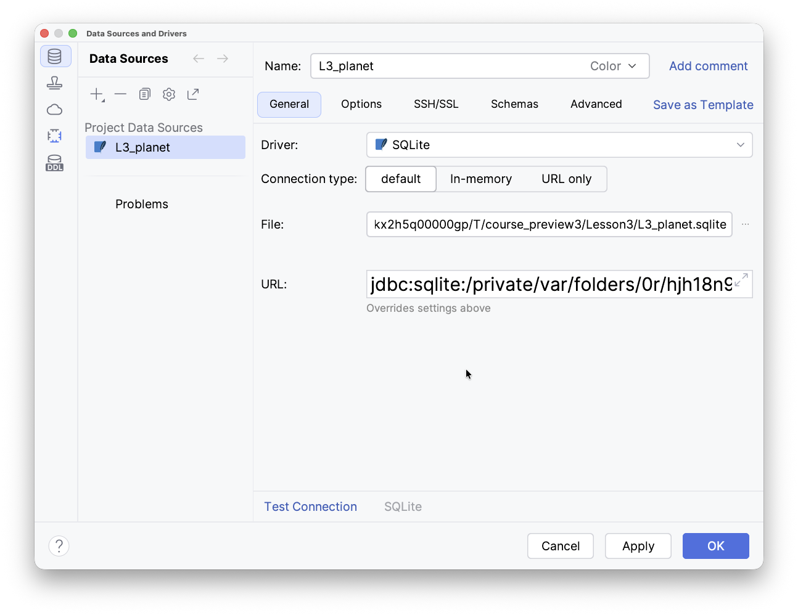
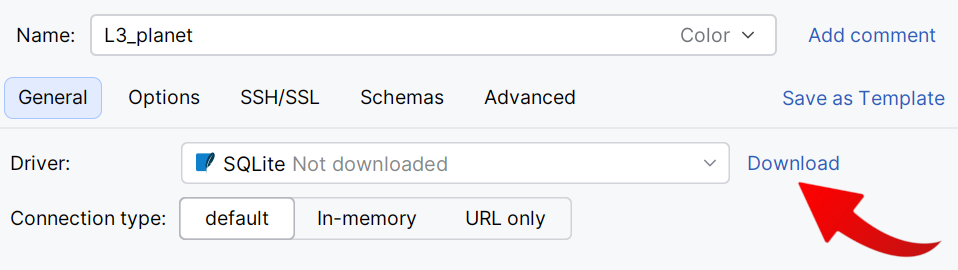
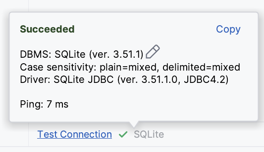
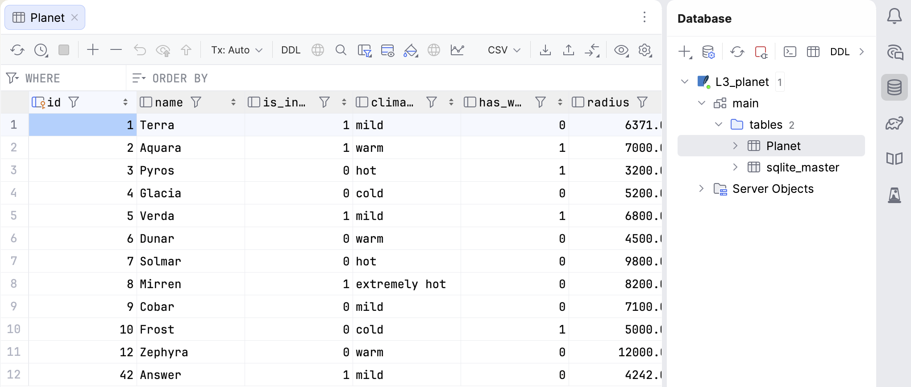

Starting with this lesson, every lesson includes a small SQLite database (this lesson includes `L3_planet.sqlite`).
You can open it directly inside %IDE_NAME% with the built-in [**Database** tools](https://www.jetbrains.com/help/idea/relational-databases.html) to browse data and run
example queries — no external program required.

> **Prerequisite.** Database tools are bundled with **IntelliJ IDEA Ultimate**. 
> They are not available in **IntelliJ IDEA Community** edition. If you don't have them,
> you can use the `sqlite3` [command-line client](https://www.sqlite.org/cli.html) instead.

To work with the database, first create a **data source** (a saved connection to the database file):

1. Double-click the database file in the lesson structure (`L3_planet.sqlite` for the current lesson). 
   The **Data Sources and Drivers** window will open:

2. If a notification appears stating that the driver is not downloaded, click the **Download** button and wait for the installation to finish:

3. Click **Test Connection** at the bottom to check that everything is working:

4. Finally, click **OK** to finish the setup.

5. The data source will now appear in the **Database** tool window on the right. In this lesson, the database contains a single table named `Planet`.
   You can view it by expanding **L3_planet** → **main** → **tables**.

Each lesson provides its own database file
(e.g., `L4_astrofleet.sqlite`, `L5_astrofleet.sqlite`). You can connect to each lesson's file following these same steps.

For more details on the Database tool, refer to the [official help page](https://www.jetbrains.com/help/idea/sqlite.html).

