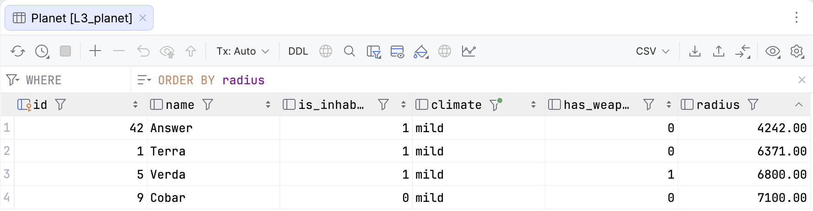

Now you know how to connect to the database and inspect data without writing a single line of SQL.

When you open the `Planet` table in the **data editor**, it displays as a spreadsheet grid where each
row is a table row and each column is a table column.

From this grid, you can explore the data using several built-in tools:

- **Sort** — Click any column header to sort. %IDE_NAME% re-runs the query with an `ORDER BY` clause on that column
  (click again to reverse the sort order).
- **Filter** — Type a condition into the filter field above the grid, or turn on **Enable Local Filter**
  to filter individual columns directly.
- **Search** — Press &shortcut:Find; (**Find**) to search within the currently visible page of rows.
- **Paging** — If a table contains more rows than fit on one page, use the pager buttons to navigate between pages.
- **View as** — Switch between **Table**, **Transpose**, **Tree**, and **Text** view formats for the same dataset.

Try sorting planets by `radius` and filtering by `climate` to get a feel for the dataset before 
writing queries. In later lessons, the database includes additional tables (such as `Spacecraft` and `Flight`) that you can browse
in the exact same way.

