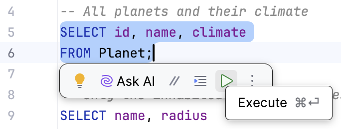
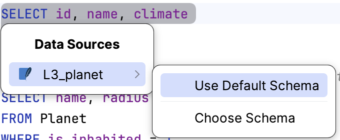
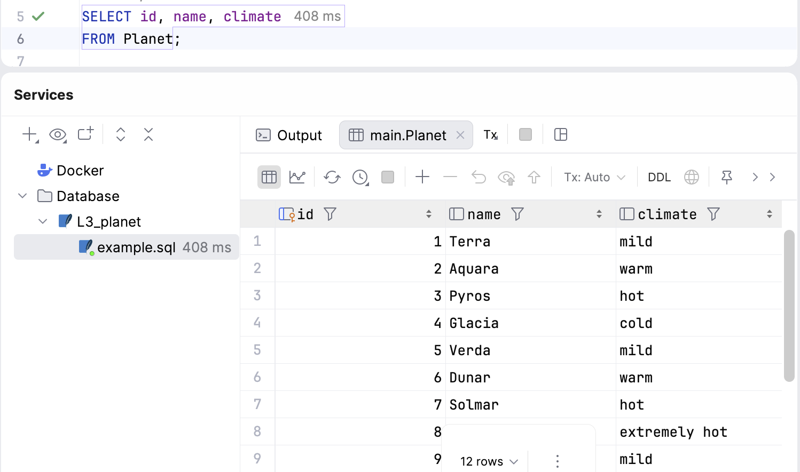
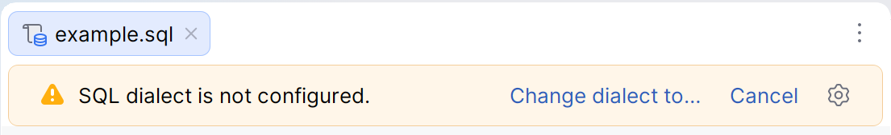
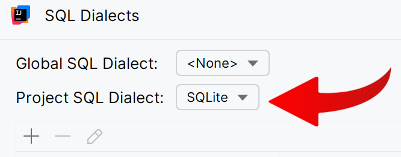
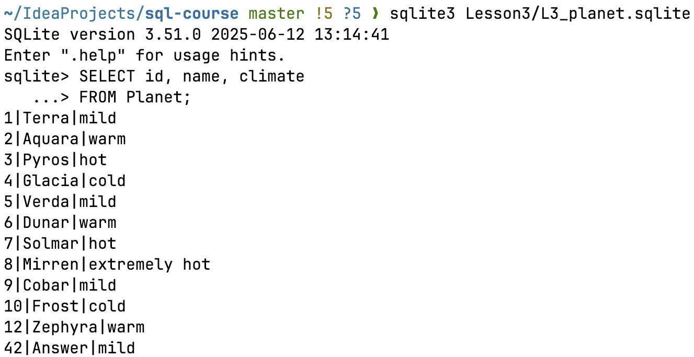

Starting with this lesson, most theory tasks ship an `example.sql` file with ready-to-run queries.
You can run them against the database you connected to in one click.
Let's practice with this task's `example.sql`, which has two simple queries.

1. Select the query you want to run, then click the  button or
   press &shortcut:Console.Jpa.Execute; to execute the selected query:

2. Next, choose the data source to run the query against (select **Use Default Schema**):

   

3. The results open in the **Services** tool window as a data grid — the same grid you saw when browsing a
   table:

  
 

### Note
 
> In this task or one of the following tasks, you may see this warning when you open an `.sql` file:
> 

> 
> 

> Click **Change dialect to…**, select **Project SQL Dialect: SQLite** in the window that appears, and click OK.
> 

> 
> 

---

**No Database tools?** Run the same queries from the command line: `sqlite3 Lesson3/L3_planet.sqlite`, then paste a
query and press Enter:

  

