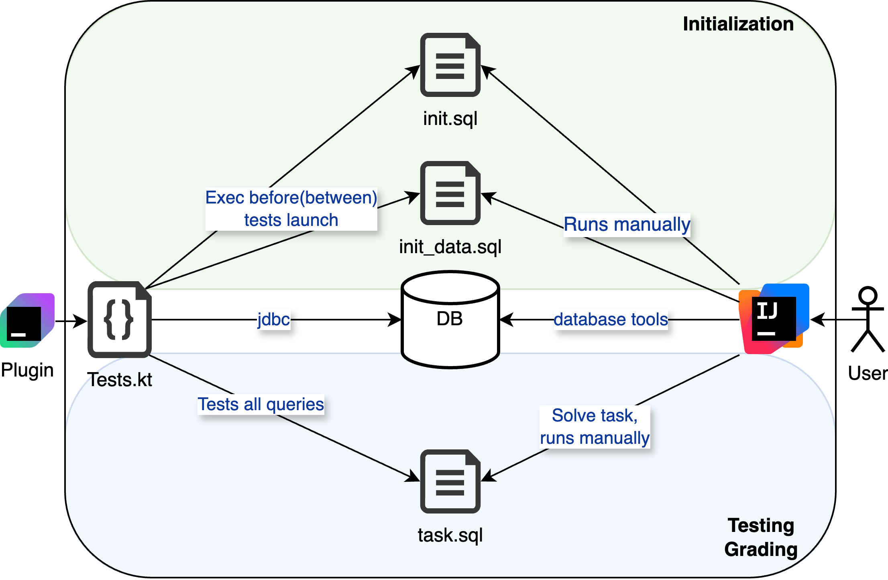

# Prototype
## Notes
- Sqlite don't have boolean `TRUE`/`FALSE` -- only `1`/`0` instead

## User-DB interaction
### JB in-IDE solutions
[Native way](https://www.jetbrains.com/pages/intellij-idea-databases/).
Not available in Community Edition.

### SQLite CLI
- `sqlite3 prototype.sqlite < init.sql`
- `sqlite3 prototype.sqlite < init_data.sql`
- `sqlite3 prototype.sqlite < src/task.sql`

### Other GUI app
Problems wit directories, multiplatforms

## Tasks scheme
```text
./
├── init.sql          // (re)create tables
├── init_data.sql     // (re)fill tables with data
├── prototype.sqlite  // DB 
├── src
│   └── task.sql      // User solving task here
└── test
    └── Tests.kt
```



## Full Feedback
```text
org.junit.ComparisonFailure: The query returned an incorrect number of rows 

EXPECTED: 
| id | name   |
|----|--------|
| 3  | Venus  |
| 4  | <null> |

ACTUAL: 
| id | name   |
|----|--------|
| 2  | Uranus |
| 3  | Venus  |
| 4  | <null> |

QUERY: 
SELECT id, name from Planet where is_inhabited=FALSE;
```